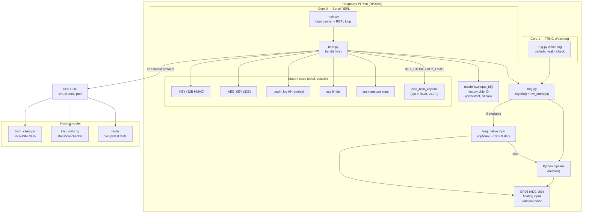

# Architecture

This document describes the pico-hsm system architecture: the dual-core
design, the TRNG pipeline, the serial protocol stack, and how the components
fit together.

## System overview

```
┌─────────────────────────────────────────────────────────────┐
│                    Raspberry Pi Pico (RP2040)                │
│                                                              │
│  ┌──────────────────────┐    ┌──────────────────────┐       │
│  │       Core 0          │    │       Core 1          │       │
│  │  (serial REPL)        │    │  (TRNG watchdog)      │       │
│  │                       │    │                       │       │
│  │  main.py              │    │  trng.py              │       │
│  │   └─ hsm.py          │    │   └─ watchdog timer   │       │
│  │      handle(line)    │    │      periodic health  │       │
│  │      volatile _KEY    │    │      reprofile on    │       │
│  │      volatile _AES_KEY│    │      degradation     │       │
│  └──────────┬───────────┘    └──────────┬───────────┘       │
│             │                           │                    │
│             │  ┌────────────────────────┘                    │
│             │  │                                             │
│             ▼  ▼                                             │
│  ┌─────────────────────────────────────────┐                │
│  │            trng.py (shared)              │                │
│  │                                          │                │
│  │  key256()  → mint volatile HMAC key     │                │
│  │  raw_entropy(n) → n TRNG bytes          │                │
│  │  (calls native C module if available)    │                │
│  └──────────┬──────────────────────────────┘                │
│             │                                                │
│             ▼                                                │
│  ┌─────────────────────────────────────────┐                │
│  │        trng_native.mpy (optional)        │                │
│  │        Native C accelerator (~100x)      │                │
│  │  ADC → health → VN debias → SHA-256 →   │                │
│  │  HMAC-DRBG                              │                │
│  └──────────┬──────────────────────────────┘                │
│             │                                                │
│             ▼                                                │
│  ┌─────────────────────────────────────────┐                │
│  │     GP26 (ADC ch0, floating input)      │                │
│  │     ← Johnson/thermal noise source       │                │
│  └─────────────────────────────────────────┘                │
│                                                              │
│  ┌─────────────────────────────────────────┐                │
│  │  machine.unique_id() (factory chip ID)  │                │
│  │  persistent device identifier (silicon)  │                │
│  └─────────────────────────────────────────┘                │
│                                                              │
└─────────────────────────┬───────────────────────────────────┘
                          │ USB CDC (virtual serial port)
                          │
┌─────────────────────────┴───────────────────────────────────┐
│                      Host computer                            │
│                                                              │
│  ┌─────────────────────────────────────────┐                │
│  │  host/hsm_client.py (pyserial)          │                │
│  │  PicoHSM class — typed protocol client   │                │
│  └─────────────────────────────────────────┘                │
│  ┌─────────────────────────────────────────┐                │
│  │  host/trng_stats.py                     │                │
│  │  Statistical sanity checker (monobit,   │                │
│  │  runs, chi-square)                      │                │
│  └─────────────────────────────────────────┘                │
│  ┌─────────────────────────────────────────┐                │
│  │  tests/ (pytest, host-side)             │                │
│  │  143 tests, no hardware needed           │                │
│  └─────────────────────────────────────────┘                │
└─────────────────────────────────────────────────────────────┘
```

## Dual-core design

The RP2040 is a dual-core ARM Cortex-M0+. Pico-hsm uses both cores:

| Core | Role | Module | Runs |
|------|------|--------|------|
| **Core 0** | Serial REPL — serves the line-based protocol | `main.py` → `hsm.py` | Continuously (REPL loop) |
| **Core 1** | TRNG watchdog — periodic health monitoring | `trng.py` | Background timer |

### Core 0: serial REPL

`main.py` is the entry point. It prints the boot banner (fingerprint, chip ID)
and enters the REPL loop:

1. Read a line from USB CDC
2. Call `hsm.handle(line)`
3. Write the response (text or JSON)
4. Repeat

`hsm.py` is a pure library — it defines `handle(line)`, the volatile key, and
the device ID, but does not run the REPL loop itself. This separation lets the
test suite import `hsm` without blocking on serial I/O.

State held by `hsm.py` (all in RAM, volatile unless opt-in persistence is used):
- `_KEY` — 32-byte HMAC key (minted at boot, destroyed on power-loss)
- `_AES_KEY` / `_AES_RK` — 32-byte AES key + expanded round keys
- `_DEGRADED` — flag if entropy source was degraded at key-mint time
- `_JSON_MODE` — toggle for JSON output
- Rate limiter state (sliding window of timestamps)
- `_audit_log` — ring buffer of challenge audit entries
- Encrypted transport state (session key, counters, active flag)
- **Persistent key (opt-in, v1.7.0):** `pico_hsm_key.enc` — encrypted HMAC
  key blob in flash (`PHSM` header + 32-byte AES-ECB ciphertext). Only
  written when `KEY_STORE <pin>` is issued; loaded with `KEY_LOAD <pin>`.

### Core 1: TRNG watchdog

A hardware timer on core 1 periodically samples the entropy source and runs a
health check. If the source degrades (bit balance, min-entropy, or serial
correlation outside thresholds), the watchdog:
1. Records the failure
2. Reprofiles the ADC (re-measures noise characteristics)
3. If degradation persists, marks the TRNG as degraded

The watchdog runs independently of core 0 — protocol commands are never
delayed by health checks. The `TRNG` command reports the current watchdog
status; `TRNG_WATCHDOG` controls it.

## TRNG pipeline

The entropy pipeline follows NIST SP 800-90A architecture:

```
  GP26 (floating ADC input)
       │
       ▼  thermal/Johnson noise (16-bit ADC readings)
  ┌──────────────────────────┐
  │  Bit extraction           │  isolate bits 4–9 (noisy region)
  │  6 bits per sample         │
  └──────────┬───────────────┘
             │
             ▼
  ┌──────────────────────────┐
  │  Health gate (per-block) │  bit balance: 0.45–0.55
  │  screens BEFORE DRBG     │  min-entropy: ≥ 6.0 bits
  │  rejects bad captures    │  serial corr: ≤ 0.30
  └──────────┬───────────────┘
             │ (pass)
             ▼
  ┌──────────────────────────┐
  │  Von-Neumann extractor    │  01→0, 10→1
  │  removes residual bias    │  00/11 discarded
  └──────────┬───────────────┘
             │
             ▼
  ┌──────────────────────────┐
  │  HMAC-DRBG (SHA-256)     │  NIST SP 800-90A
  │  cryptographic extractor  │  reseeded every generation
  │  backtracking resistance  │  → key256() or raw_entropy(n)
  └──────────┬───────────────┘
             │
             ▼
  volatile _KEY (32 bytes)  or  SEED output (1–8192 bytes)
```

### Native C accelerator

The entire hot path (ADC sampling → health gate → VN debias → SHA-256 →
HMAC-DRBG) is also implemented as a native C module
(`pico/native/trng_native.c`). When `trng_native.mpy` is present on the
filesystem, `trng.py` uses it automatically — a ~100x speedup (SEED drops from
~20s to under 1s for 256 bytes). The Python pipeline remains as a transparent
fallback if the native module is absent.

```
  trng.py
    ├── if trng_native available:
    │     raw_entropy(n) → trng_native.seed(n)   [C, ~100x faster]
    │     key256()       → trng_native.key256()  [C]
    │
    └── else (Python fallback):
          raw_entropy(n) → ADC → health → VN → HMAC-DRBG  [Python]
          key256()       → raw_entropy(32)               [Python]
```

## Serial protocol stack

```
  ┌──────────────────────────────────────────────────────────┐
  │  Application layer — hsm.handle(line)                    │
  │                                                          │
  │  Commands: WHO, PING, CHALLENGE, SEED, SEED_STREAM,      │
  │    AES_ENC/DEC/CTR, TRNG, RATE_LIMIT, JSON, AUDIT,      │
  │    ENC, ENC_MSG, KEY_STORE/LOAD/ERASE/STATUS,           │
  │    HELP, VERSION                                        │
  └──────────┬──────────────────────────────────┬───────────┘
             │                                  │
      (plaintext)                        (encrypted)
             │                                  │
             ▼                                  ▼
  ┌─────────────────────┐     ┌──────────────────────────────┐
  │  Text / JSON format │     │  AES-CTR transport           │
  │  _format(resp)      │     │  ENC ON → session key         │
  │  _JSON_MODE toggle  │     │  ENC_MSG <ctr> <ct_hex>       │
  └──────────┬──────────┘     │  replay protection (counter) │
             │                └──────────┬───────────────────┘
             │                           │
             └───────────┬───────────────┘
                         │
                         ▼
  ┌──────────────────────────────────────────────┐
  │  Rate limiter (sliding window + lockout)     │
  │  Audit log (ring buffer, CHALLENGE forensics) │
  └──────────┬───────────────────────────────────┘
             │
             ▼
  ┌──────────────────────────────────────────────┐
  │  USB CDC (virtual serial port)                │
  │  line-based: one command → one response       │
  └──────────────────────────────────────────────┘
```

### Encrypted transport (optional layer)

When `ENC ON <nonce_hex>` is issued, a session key is derived and all
subsequent commands are encrypted with AES-CTR:

```
  Handshake (plaintext):
    Host → CHALLENGE <nonce>
    Pico → RESPONSE <hmac(key, nonce)>

  Session key derivation (both sides):
    session_key = SHA-256(b"enc-session:" + nonce + hmac(key, nonce))

  Encrypted mode:
    Host → Pico:   ENC_MSG <rx_counter> <ciphertext_hex>
    Pico → Host:   ENC_MSG <tx_counter> <ciphertext_hex>

  Exit:
    ENC OFF → clears session state
```

The session key is derived from the volatile HMAC key and a nonce. Both sides
can compute it independently: the host received `hmac(key, nonce)` from the
CHALLENGE response, and the Pico recomputes it from its in-RAM key.

### Rate limiter and audit log

These cross-cutting concerns wrap all sensitive commands:

- **Rate limiter**: sliding 10-second window on CHALLENGE/SEED/SEED_STREAM.
  More than 10 requests → lockout with exponential backoff (2s base, doubling,
  capped at 60s). `RATE_LIMIT STATUS` / `RATE_LIMIT RESET` to manage.
- **Audit log**: ring buffer (64 entries) recording every CHALLENGE with
  timestamp, challenge hash, and result. `AUDIT [N|CLEAR]` to query.

## Memory map (RP2040, 264 KB RAM)

```
  ┌───────────────────────────────────┐  high
  │  MicroPython runtime + heap       │
  │  (interpreter, GC, stack)         │
  ├───────────────────────────────────┤
  │  hsm.py state (volatile):         │
  │    _KEY          32 bytes         │
  │    _AES_KEY      32 bytes         │
  │    _AES_RK      240 bytes (round) │
  │    _audit_log  ~4 KB (64×~64B)    │
  │    rate limiter ~0.5 KB           │
  │    enc state    ~0.1 KB           │
  ├───────────────────────────────────┤
  │  trng.py state:                   │
  │    DRBG state   ~0.5 KB           │
  │    watchdog     ~0.2 KB           │
  ├───────────────────────────────────┤
  │  USB CDC buffers                  │
  └───────────────────────────────────┘  low
```

The key material is small (< 0.5 KB total). The audit log is the largest
state consumer. None of this persists to flash by default — power-loss
destroys everything except the factory chip ID (in silicon).

**Exception (opt-in, v1.7.0):** if the user issues `KEY_STORE <pin>`, the
HMAC key is encrypted (AES-ECB, PIN-derived key) and written to flash as
`pico_hsm_key.enc` (36 bytes: 4-byte `PHSM` header + 32-byte ciphertext).
This is the only flash-persisted secret. `KEY_ERASE` deletes it; `KEY_LOAD
<pin>` reads and decrypts it back into RAM.

## Mermaid diagram



## Data flow: challenge-response

```
  Host                                    Pico (RP2040)
  ────                                    ────────────
  │                                         │
  │  WHO                                    │
  │ ──────────────────────────────────────► │
  │                                         │ hsm.handle("WHO")
  │                                         │ → read _KEY fingerprint
  │                                         │ → read machine.unique_id()
  │  ID ... DEVICE <chip_id> FINGERPRINT <fp>│
  │ ◄────────────────────────────────────── │
  │                                         │
  │  CHALLENGE <nonce>                      │
  │ ──────────────────────────────────────► │
  │                                         │ _rate_check("CHALLENGE")
  │                                         │ _audit_record("CHALLENGE", nonce)
  │                                         │ _hmac_sha256(_KEY, nonce)
  │  RESPONSE <hmac_hex>                    │
  │ ◄────────────────────────────────────── │
  │                                         │
  │  verify: hmac(key, nonce) == response   │
  │  (host has the key from provisioning)   │
  │                                         │
```

The host never receives the key — only its fingerprint (`sha256(key)`) and the
HMAC output. The key exists only in the Pico's RAM.

## Data flow: persistent key (opt-in, v1.7.0)

The persistent key feature is strictly opt-in. The default flow (above) has
no flash component. When the user chooses to persist the key:

```
  KEY_STORE <pin>:
    _KEY (RAM, 32B)
      │
      ▼
    _derive_pin_key(pin)           1000-round iterated SHA-256
      │                              salt = b'pico-hsm-persist-v1'
      ▼
    AES-ECB encrypt(_KEY, pin_key) → ciphertext (32B)
      │
      ▼
    flash: pico_hsm_key.enc = b'PHSM' + ciphertext (36B)

  ── Reboot Pico (RAM cleared, _KEY re-minted fresh) ──

  KEY_LOAD <pin>:
    flash: pico_hsm_key.enc
      │
      ▼
    verify header == b'PHSM', len == 36
      │
      ▼
    _derive_pin_key(pin)           same KDF
      │
      ▼
    AES-ECB decrypt(ciphertext, pin_key) → plaintext (32B)
      │
      ▼
    _KEY = plaintext               replaces volatile key in RAM
    _DEGRADED = False
      │
      ▼
    return fingerprint             host verifies it matches

  KEY_ERASE:   os.remove('pico_hsm_key.enc')
  KEY_STATUS:  persistent = os.path exists; degraded = _DEGRADED
```

**Wrong PIN:** AES-ECB has no integrity check, so decryption succeeds but
produces a garbage key. The host can detect this: the fingerprint returned by
`KEY_LOAD` will differ from the one returned by `KEY_STORE`.
